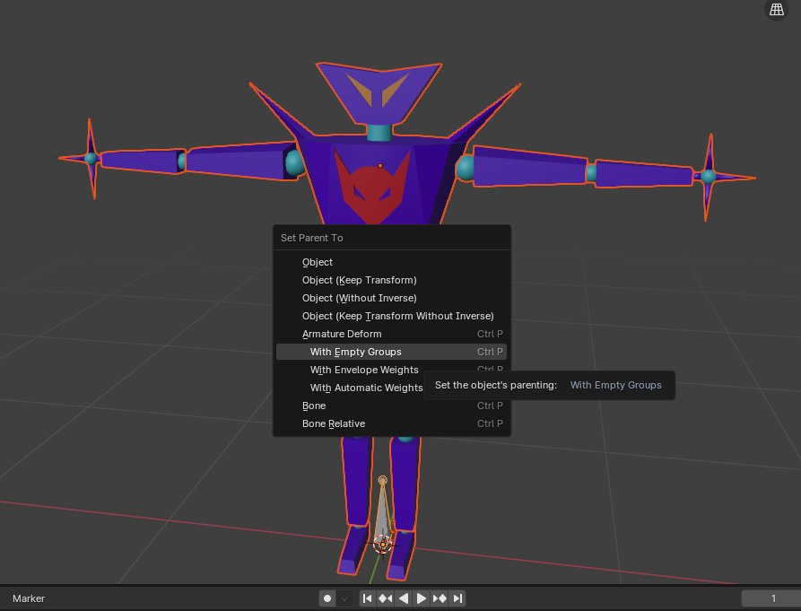
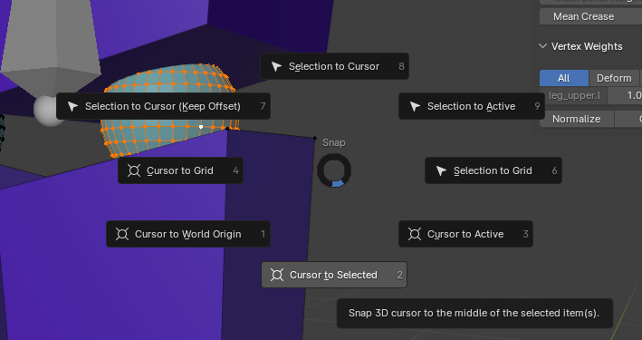
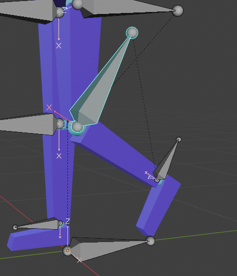
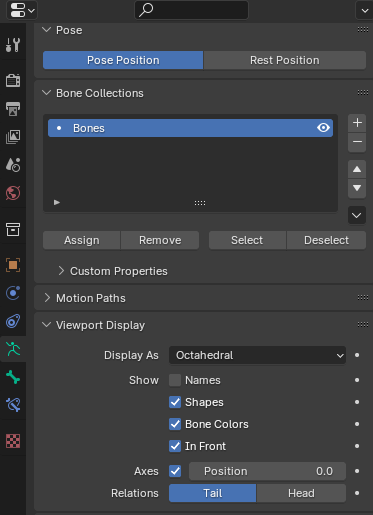
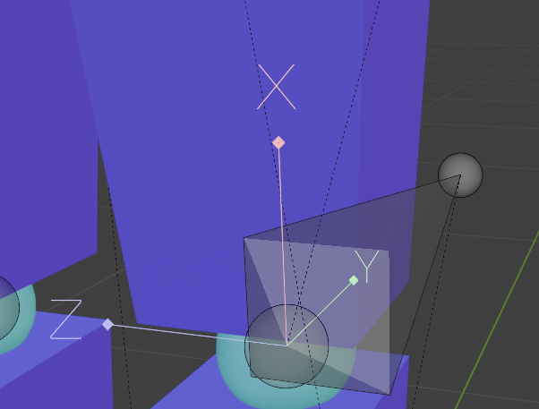
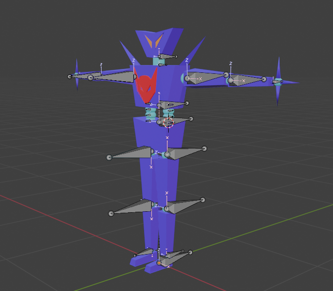

# Overview
Creating an armature for your model allows the mesh to move. It uses `bones` that are parented
to each other in order to move the mesh.

## Create the Armature
`Shift+A` to open the add menu. `Armature` to add an armature to the scene. 

Once it's added, move it to the top level of the `Scene` so you your collection and armature separate.

## Parent the Mesh to the Armature
Now we add bones to the armature where bones would exist in the mesh. When you create an armature
it will create a single bone where you cursor is currently. Move the tip of the bone upwards so
that you can see the bone more easily.

You can now parent the mesh to the armature by first selecting the bone and then pressing `A` to 
select all objects. The bone should be lighter orange than the mesh.

Press `Ctrl+P` to open the parenting window and select `Armature Deform With Empty Groups`.

!!! note
    You can use `With Automatic Weights`, but you should do this after creating the full skeleton.
    Blender will try and associate the mesh with the bones automatically. For full control, I like
    to use `With Empty Groups`.

## Create, Name, and Parent the Bones
Name the initial bone `root`

Then in bone `Edit Mode`, select the root bone and press `Shift+D` to duplicate the bone. Move the duplicated bone 
where you want and rename the bone.

???+ tip "Tip: Bones in Front"
    Enable the `In Front` option under `Data -> Viewport Display -> In Front` so that the bones are always
    displayed in front of the mesh. 

    

Continue making bones for the left side of the body. Append `.l` to the left side bone names (i.e. `upper_arm.l`). This will all the 
`Symmetrize` to make the right side bones with `.r` appended in the name automatically (i.e. `upper_arm.r`). 

Parent the bones appropriately as you go in the `Bone -> Relations -> Parent` input field.

???+ tip "Tip: Bone Head at Joint"
    Put the location of the Head of the bone exactly where you want that joint to rotate. The easisest way
    to do this is to put the cursor to the joint by going to mesh `Edit Mode` and selecting the vertices
    where the joint is. Press `Shift+S` to open the cursor menu and select `Cursor to Selected`.

    

    Then go back to bone `Edit Mode` and select the Head of the bone. Then press `Shift+S` and select
    `Selection to Cursor`. This will perfectly move the bone head to the joint.

    

    It should look like this:

    

## Symmetrize
Once you have the bones on the `+X` side of the mesh, you can mirror the bones across the `Y` axis
in the Bone `Edit Mode` under `Armature -> Symmetrize`. Select all of the bones you want to `Symmetrize`
before doing so.

## Bone Vertex Groups
Now that we have all of the bones that we need to control our mesh, we need to assign the vertices
that will be moved when a specific bone is used. Do this by going to mesh `Edit Mode` and selecting
the vertices for a specific bone.

!!! warning
    The vertex groups should be created automatically for the bones. If they don't exist, reparent
    the mesh to the armature and the Vertex Groups will be created.

Once all of the vertices have been assigned to the propert Vertex Groups, you can test it out by
going to bone `Pose Mode` and moving or rotating a bone.

!!! warning
    Make sure that the Transform Pivot Point is set to Bounding Box Center.
    

!!! note
    This method assumes vertices are only moved by a single bone. If the mesh needs to be moved 
    by multiple bones, `Weight Painting` comes into play. See the next page.

## Rotate Bones for UE5
The Bone Transform in Blender is also different than the Bone Transform in UE5. To accommodate for this,
we have to rotate the bones so that the `X` axis goes along the bone. To start, we need to enable the
bone axes in `Data -> Viewport Display -> Axes`

You should now see the bone axes. 

Rotate the bones to the correct position.

!!! tip "Tip: Rotate the Bone Tip"
    In bone `Edit Mode` select the bone tip and rotate along the desired access by `+/-90`. This will leave
    the head in place and put the tip in the correct location.

Edit the `Roll` of the bone to get the correct `Z` axis direction.

Bones on the left side of the body and the spine bones will point backwards. Bones on the right side
of the body will point forwards. 

!!! tip
    Import a working `FBX` into Blender to see the correct bone orientations. Make your bone orienations
    match.

## Finished
Once your mesh looks like this, you are ready to export to `FBX` and import into UE5!