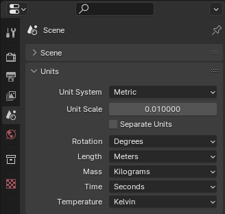
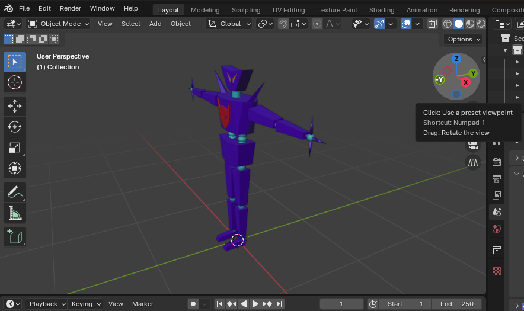

# Overview
Creating a Mesh.

## Seting the Unit Scale
UE5 uses `cm` for its Unit Scale. Change the `Unit Scale` to `0.01` in Blender in `Scene -> Units`.

## Model Direction
Rotate your model so that it is facing in the `-Y` direction. This will make it so it is facing the
correct direction when imported into UE5.

