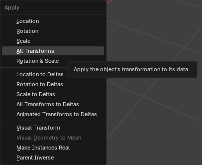
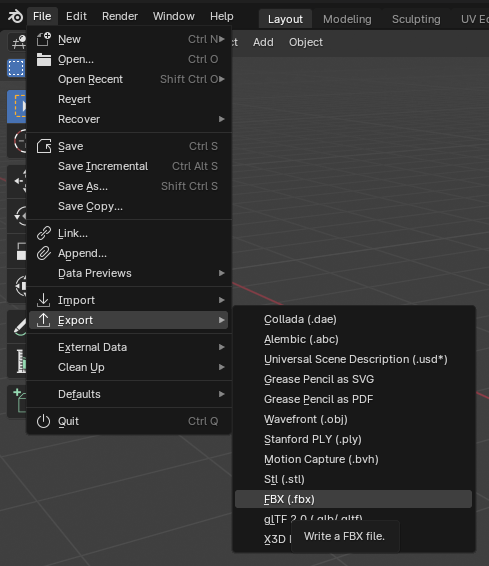
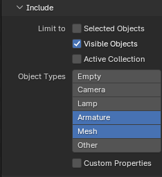
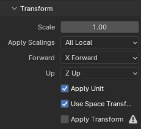
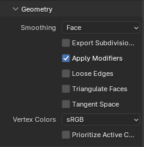
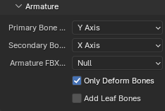

# Overview
These are the settings to use when exporting a Blender model to Unreal Engine 5. Export to `FBX`.

## Before Exporting
Before exporting the 3D Model, apply the transform.

Press `Ctrl+A` and select `All Transforms`.

## Open Export Menu
Now we are ready to export the 3D Model to UE5! Open the Export Menu.

## Include
What from Blender to include in the export.

!!! note
    You can use `Selected Objects` but it can be tedious to remember to select everything before
    exporting, especially if you need to export several times.

!!! danger
    If you have a backup of your mesh, make sure that it is hidden when using `Visible Objects`.

## Transform
The Unreal coordinate system uses different axes than Blender. Unreal uses the `x` axis for 
forward, and `z` axis for up.

## Geometry
Change the smoothing from `Normals` to `Face`. This clears up a bunch of smoothing warnings in Unreal
when importing the `FBX` model.

## Armature

## Conclusion
Once the `FBX` is exported, it is ready to be imported into Unreal Engine 5.