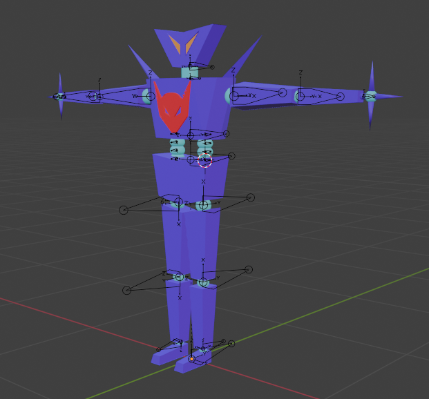
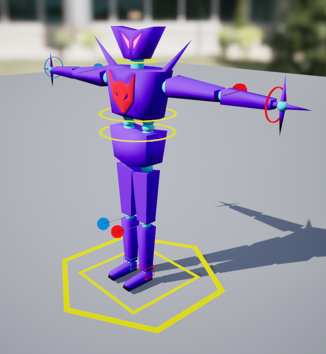

# Welcome
This website is dedicated to explaining in detail the Blender and Unreal Engine 5 workflow. It will provide
answers to common gotchas and frequently asked questions.

Go from this:

to this:

 

to this:

<video width="400" autoplay loop muted>
<source src="anim_example.mp4" type="video/mp4">
</video>
